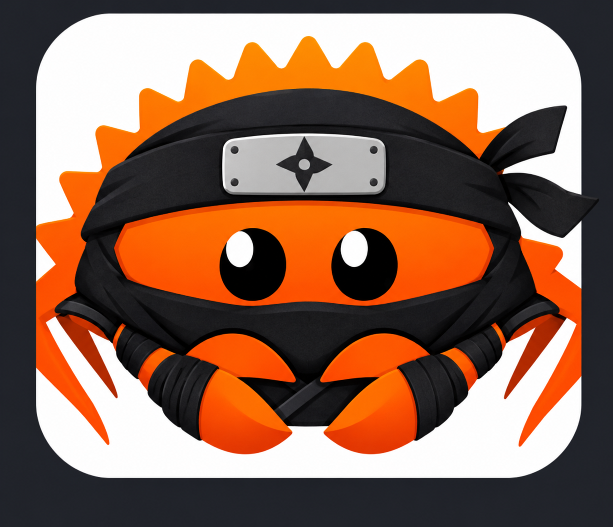

<p align="center">
  
</p>

# Kouga

作りたい API から、書き始めよう。

Kouga は、Rails の API モードに着想を得た Rust 製 API フレームワークです。HTTP/JSON と gRPC/Protobuf の入口を同じプロジェクトに置き、業務コードを共有できます。入力検証、PostgreSQL、認証、ジョブ、OpenAPI などを必要に応じて追加できます。

> **開発版** — CLI はこのリポジトリからビルドして試せます。crate・CLI の配布と安定版の公開はまだ行っていません。実装状況と制限は[開発版の現在地](user-docs/preview.md)を参照してください。

## 名前の由来

友達に甲賀の里出身がいて、「甲」という漢字が蟹の甲羅と被るのもなんかいいと思いました。あとは `kouga` がコマンドで僕にとって打ちやすかったから。そういう、しょうもない理由でこの名前にしました。

## 最初の API を動かす

Rust 1.94.0 が必要です。Kouga の checkout で CLI をビルドし、アプリは checkout の外に作成します。

```sh
cargo +1.94.0 build -p kouga-cli --locked
export PATH="$PWD/target/debug:$PATH"
cd ..
kouga new hello-kouga
cd hello-kouga
RUSTUP_TOOLCHAIN=1.94.0 kouga server
```

別のターミナルから `curl http://127.0.0.1:3000/health` を実行すると、生成アプリのヘルスチェックを確認できます。生成アプリはビルド元の Kouga checkout を path 依存で参照するため、その checkout を保持してください。

PostgreSQL を使った CRUD API の生成から起動までは[最初の API を作る](user-docs/getting-started.md)に手順があります。

## 主な機能

- Request の検証、controller、model、SQL migration を組み合わせた HTTP API
- ルート・Request・レスポンスの定義から生成する OpenAPI と開発用 API ドキュメント
- 同じ業務コードを使う HTTP と gRPC の独立した入口
- 認証、queue・worker、メール、ストレージ、WebSocket、OpenTelemetry
- 入口や worker ごとに分けられる Docker イメージ

## ドキュメント

- [利用者向けガイド](user-docs/README.md) — 機能、実行例、制限
- [通しのチュートリアル](user-docs/tutorial.md) — 生成アプリでの実行手順
- [CLI リファレンス](user-docs/reference.md) — コマンド一覧
- [仕様](docs/specification.md)・[API 契約](docs/api-contracts.md) — 設計と公開型
- [開発タスク](docs/development-tasks.md)・[再監査](docs/release-verification.md) — 実装状況と公開前の残件

Rust の変更を確認する際は、Rust 1.94.0 で `fmt --check`、workspace 全体の Clippy とテストを実行します。具体的なコマンドと作業単位は [AGENTS.md](AGENTS.md) に記載しています。
